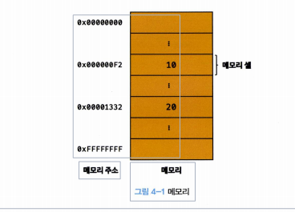

# 04장변수

### **4.1 변수란 무엇인가? 왜 필요한가?**

변수는 프로그래밍 언어에서 데이터를 관리하기 위한 핵심개념

각 셀은 고유의 메모리 주소를 갖는다. 이 메모리 주소는 메모리 공간의 위치를 나타내며, 0부터 시작해서 메모리의 크기만큼 정수로 표현된다. 예를들어，4GB 메모리는 0부터 4,294,967,295

( 0 x 0 0 0 0 0 0 0 0 〜 0 x F F F F F F F F ) 까지의 메모리 주소를 갖는다.

ex)10+20=30 일때 30이란값은 메모리주소 어딘가에 랜덤으로 저장될 것이고 이것을 재사용하기 위해 30에 대한 값을 불러오기위해 메모리에 접근하려는 경우

**사용자가 직접적으로 메모리 주소에 접근하는 것은 보안 및 안정성 문제로 인해 권장되지 않습니다.**

컴퓨터의 메모리는 운영체제에 의해 관리되는 중요한 자원입니다. 런타임환경으로 얻은 메모리영역이 아니라 운영체제가 작동하는 메모리를 실수로 건드린다면 치명적인 오류를 발생시킬 것입니다.

또한, 운영체제는 메모리 관리를 통해 여러 프로세스가 안전하게 메모리를 공유하고 충돌이 발생하지 않도록 보장합니다. 사용자가 메모리 주소에 직접 접근하면 이러한 메모리 관리 기능을 우회하게 되어 시스템의 안정성과 보안에 위협이 될 수 있습니다.//웹 브라우저의 자바스크립트 엔진이나 Node.js와 같은 런타임 환경은 해당 애플리케이션을 실행하기 위한 메모리 공간을 운영체제로부터 할당받아 사용합니다.

따라서, 일반적으로 사용자는 메모리 주소에 직접 접근하지 않고 프로그래밍 언어나 라이브러리를 통해 추상화된 인터페이스를 사용하여 메모리에 접근하고 값을 조작합니다. 이를 통해 시스템의 안정성과 보안을 보장하며, 프로그램을 안전하게 실행할 수 있습니다.

**변수variable는 하나의 값을 저장하기 위해 확보한 메모리 공간 자체 또는 그 메모리 공간을 식별하기 위해 붙인 이름을 말한다.**

따라서 개발자가 직접 메모리 주소를 통해 값을 저장하고 참조할 필요가 없고 변수를 통해 안전하게 값에 접근할 수 있다.

변수에 값 을 저장하는 것을 할당(대입, 저 장 )이라 하고，변수에 저장된 값을 읽어 들이는 것을 참조
reference 라고 한다.

### **4.2 식별자**

변수 이름을 식별자라고도 한다. 식별자는 어떤 값을 구별해서 식별 할 수 있는 고유 한 이름을 말 한다 .
사람을 이름으로 구별해서 식별하는 것처럼 값도 식별자로 구별해서 식별할 수 있다.

즉 , 식별자는 값이 저장되어 있는 메모리 주소 와 매핑 관계를맺으며 , 이 매핑 정보도 메모리에 저장되어야 한다. 식별자는 값이 아니라 메모리 주소를 기억하고 있다.

//식별자라는 용어는 변수 이름에만 국한해서 사용하지 않는다. 예를 들어, 변수，함수, 클래스 등의 이름은 모두 식별자다. 식별자인 변수 이름으로는 메모리 상에 존재하는 변수 값을 식별할 수 있고，함수 이름으로는 메모리 상에 존재하는 함수(자바스크립트에서 함수는 값이다)를 식별할 수 있다. 즉 ，메모리 상에 존재하는 어떤 값을 식별할 수 있는 이름은 모두 식별자라고 부른다.

### **4.3 변수선언**

변수 선언 이란 변수를 생성 하는 것을 말한다. 값을 저장하기 위한 메모리 공간을 확보하고 변수 이름과 확보된 메모리 공간의 주소를 연결해서 값을 저장할 수 있게 준비한다.

**변수를 시용하려면 반드시 선언이 필요하다. 변수를 선언할 때는 v a r , l e t , c o n s t 키 워드를 사 용한다 .** //ES6에서 let, const키워드가 도입되기 이전까지 var 키워드는 자바스크립트에서 변수를 선언할 수 있는 유일한 키워드

**ES5 v s . ES6**

아직 살펴보지 않았지만 var 키워드는 여러 단점3이 있다. var 키워드의 여러 단점 중에서 가 장 대표적인 것이 블록 레벨 스코프block-level scope를 지원하지 않고 함수 레벨 스코프 function- level scope를 지원한다는 것이다. 이로 인해 의도치 않게 전역 변수가 선언되어 심각한 부작용이 발생하기도 한다.

변수 선언에 의해 확보된 메모리 공간은 비어있을 것으로 생각하나 확보된 메모리 공간에는 undefined라는 값이 암묵적으로 할당되어 초기화된다. 자바스크립트의 독특한 특징이다.

■ 선언 단계: 변수 이름을 등록해서 자바스크립트 엔진에 변수의 존재를 알린다.
■초기화 단계: 값을 저장하기 위한 메모리 공간을 확보하고 암묵적으로 undefined 를 할당해 초기화한다.

**변수 이름은 어디에 등록되는가?**

변수 이름을 비롯한 모든 식별자는 실행 컨텍스트에 등록된다. 실행 컨텍스트execution context는 자바스크립트 엔진이 소스코드를 평가하고 실행하기 위해 필요한 환경을 제공하고 코드의 실행 결과를 실제로 관리 하는 영역이다. 자바스크립트 엔진은 실행 컨텍스트를 통해 식별자와 스코프를 관리한다.

### **4.4 변수 선언의 실행 시점과 변수 호이스팅**

호이스팅이란, 먼저 자바스크립트 코드는 인터프리터에 의해 한 줄씩 순차적으로 실행됩니다.

console.log(score); 가 먼저 실행되고 다음줄에 있는 코드를 실행합니다. 원래라면 undifined가 아니라 참조에러 refrence error가 발생할 것처럼 보입니다. 하지만 undifined가 발생합니다.

그 이유는 자바스크립트 엔진은 런타임 시점이 아니라 그이전단계인 소스코드 실행을 위한 준비단계인 소스코드 평가 과정에서 변수선언,함수선언등 모든 선언문을 소스코드에서 찾아 먼저 실행하게 됩니다. 그리고 평가 과정이 끝나고 비로소 변수 선언을 포함한 모든 선언문을 제외하고 소스코드를 한줄씩 순차적으로 실행합니다.//var는 호이스팅 됨, let, const는 호이스팅은 되지만 변수가 선언되어도 초기화 되지 않았을때 해당 변수를 참조하는 것은 불가능 (일시적인 사각지대)

**이처럼 변수 선언문이 코드의 선두로 끌어 올려진 것처럼 동작하는 자바스크립트 고유의
특징을 변수 호이스팅이라 한다**

### 4.5 값의 할당

하나의 문으로 작성해도 정확히 동일하게 동작

**변수 선언**은 소스코드가 순차적으로 실행되는 시점인 **런타임 이전에 먼저 실행**되지만 **값의 할당**은 소스코드가 순차적으로 실행되는 시점인 **런타임에 실행**된다.

### **4.6 값의 재할당**

재할당이란 이미 값이 할당되어 있는 변수에 새로운 값을 또다시 할당하는 것을 말한다.

var 키워드로 선언한 변수는 선언과 동시에 undefined로 초기화되기 때문에 엄밀히 말하자면 변수에 처음으로 값을 할당하는 것도 사실은 재할당이다.

만약 값을 재할당할 수 없어서 변수에 저장된 값을 변경할 수 없다면 변수가 아니라 상수constant라 한다.

**const 키워드**

ES6에서 도입된 const 키워드를 사용해 선언한 변수는 재할당이 금지된다.

**가비지 콜렉터 garbage collector**

변수에 재할당을 할시 해당 메모리주소에 값이 다른 값으로 변경 되는 것이 아니라 다른 메모리주소에 재할당 되는데 이전에 사용되던 대체된 값들은 자바스크립트로 인해 메모리를 해제하고 메모리 누수를 방지한다 .// 자바스크립트는 매니지드 언어로서 가비지 콜렉터를 내장하고 있기때문에 개발자의 직접적인 메모리 제어를 허용하지 않고 가비지 콜렉터가 자동으수행하도록 한다. 반대로 c언어 같은 언매니지드 언어는 malloc() 과 free()같은 저수준 메모리 기능을 제공한다.

06

### 4.7 식별자 네이밍 규칙

식별자는 어떤 값을 구별해서 식별해낼 수 있는 고유한 이름을 말한다. 식별자는 다음과 같은 네이밍 규칙을 준수해야한다.

-   식별자는 특수문자를 제 외한 문자, 숫자，언더스코어(\_), 달러기호($) 포함 할 수 있다.
-   단, 식별자는 특수문자를 제외한 문자, 언더스코어(一), 달러 기호($)로 시 작해야 한다. 숫자 로 시 작하는 것은 허용하지 않는다.
-   예약어는 식별자로 사 용 할 수 없다.

변수 이름도 식별자이므로 위 네이밍 규칙 을 따라야 한다 .

참고로 변수는 쉼표(,)로 구분해 하나의 문에 여러 개를 한번에 선언가능하다. 하지만 가독성이 나빠지므로 권장하지 않는다.

유니코드 문자를 허용하기에 알파벳외의 한글이나 식별자도 사용 가능하지만 알파벳 외의 유니코드문자로 명명된 식별자를 사용하는 것은 바람직하지 않으므로 권장하지 않는다.

**네이밍 컨벤션**

자바스크립트에서는 일반적으로 변수나 함수의 이름에는 카멜 케이스를 사용하고, 생성자 함수，클래스의 이름에는 파스칼 케이스를 사용한다.

ECMAScript 사양에 정의되어 있는 객체와 함수들도 카멜 케이스와 파스칼 케이스를 사용하고 있다. 따라서 코드 전체의 가독성을 높이려면 카멜 케이스와 파스칼 케이스를 따르는 것이 유리하다.
