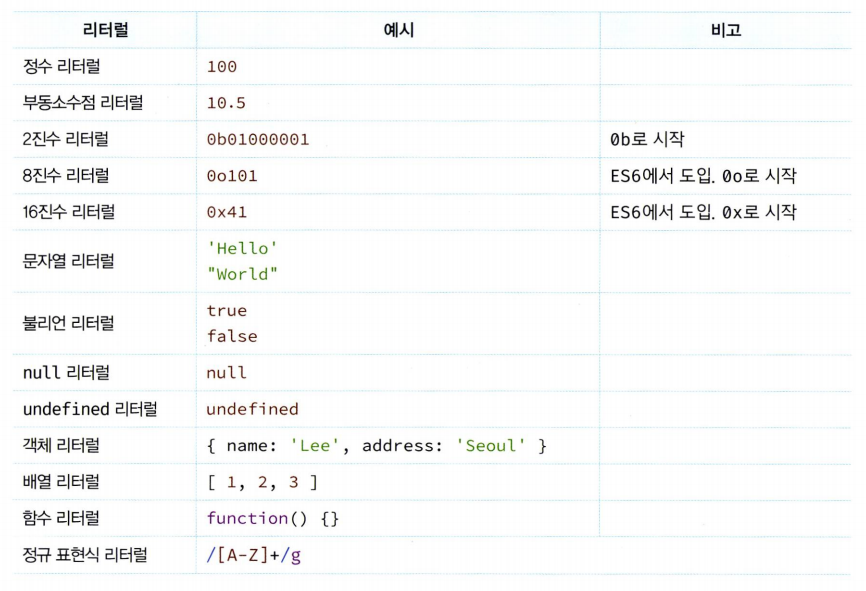

# 05장 표현식과 문

### **5.1 값**

값value는 식(표현식expression)이 평가evaluate되어 생성된 결과를 말한다.

평가란 식을 해석해서 값을 생성하거나 참조하는 것을 의미한다.

다음 예제의 식은 평가되어 숫자 값 30을 생성한다.

```jsx
//10 + 20은  평가되어 숫자 값 30을 생성한다.
10 + 20; // 30
```

```jsx
//변수에는  10 + 20이 평가되어 생성된 숫자 값 30이 할당된다.
var sum = 10 + 20;
```

10 + 20은 할당 이전에 평가되어 값을 생성

### 5.2 리터럴

리터럴literal은 사람이 이해할 수 있는 문자 또는 약속된 기호를 사용해 값을 생성하는 표기법notation을 말한다.

```jsx
//숫자 리터럴 3
3;
```

위 예제의 3은 단순한 아라비아 숫자가 아니라 숫자 리터럴이다. 사람이 이해할 수 있는 아라비아 숫자를 사용해 리터럴 3을 코드에 기술하면 자바스크립트 엔진은 이를 평가해 숫자 값 3을 생성한다.

> 이처럼 리터럴은 사람이 이해할 수 있는 문자 (아라비아숫자, 알파벳, 한글 등) 또는 미리 약속된 기호( ‘’, "", ., [], { } ，// 등 )로 표기한 코드다.

자바스크립트 엔진은 코드가 실행되는 시점인 런타임runtime 에 리터럴을 평가해 값을 생성한다.



### 5.3 표현식

표현식expression은 값으로 평가될수 있는 문statement이다. 즉, 표현식이 평가되면 새로운 값을 생성하거나 기존 값을 참조한다.

앞서 살펴본 리터럴은 값으로 평가된다. 리터럴도 표현식 이다.

```jsx
var score = 100;
```

100은 리터럴이다. 리터럴 100은 자바스크립트 엔진에 의해 평가되어 값을 생성하므로 리터럴은
그 자체로 표현식이다. // 단지 리터럴존재 하나로 값이 생성된다. 생성되려면 엔진에 의해 평가된다.

```jsx
var score = 50 + 50;
```

리터럴과 연산자로 이뤄져 있는 위 예제도 50 + 50은 평가되어 숫자값 100을 생성하므로 표현식이다.

```jsx
score; // 100
```

변수 식별자 `score`를 참조하면 변수 값으로 평가된다.

식별자 참조는 값을 생성하지는 않지만 값으로 평가되므로 표현식이다.

```jsx
// 리터럴 표현식
10;
("Hello ");

// 식별자 표현식 (선언이 이미 존재한다고 가정)
sum;
person.name;
arr[l];

// 연산자 표현식
10 + 20;
sum = 10;
sum !== 10;

// 함수/메서드 호출 표현식 (선언이 이미 존재한다고 가정 )
square();
person.getName();
```

### 5.4 문

**문statement은 프로그램을 구성하는 기본 단위이자 최소 실행 단위다.**

문의 집합으로 이뤄진 것이 바로 프로그램이며, 문을 작성하고 순서에 맞게 나열하는 것이 프로그래밍이다.


문은 여러 토큰으로 구성된다.

**토큰token이란 문법적인 의미를 가지며, 문법적으로 더 이상 나눌 수 없는 코드의 기본 요소를 의미한다.**

예를 들어 키워드, 식별자, 연산자, 리터럴, 세미콜론(;)이나 마침표(.)등의 특수 기호는 문법적 의미를 가지며, 더이상 나눌 수 없는 코드의 기본 요소이므로 모두 토큰이다.

```jsx
// 변수 선언문
var x;

// 표현식 문(할당문)
x = 5;

// 함수 선언문
function foo() {}

// 조건문
if (x > 1) {
    console.log(x);
}

// 반복문
for (var i = 0; i < 2; i++) {
    console.log(i);
}
```

### 5.5 세미콜론(;)

세미콜론은 문의 종료를 나타낸다.

문을 끝낼 때는 세미콜론을 붙여야 한다.

다만, 0개 이상의 문을 중괄호로 묶은 코드 블록(`{...}` )뒤에는 세미콜론을 붙이지 않는다. 예를 들어 if문, for문, 함수 등의 코드 블록 뒤에는 세미콜론을 붙이지 않는다.

```jsx
if (condition) {
    // 코드 블록
    // ...
} // 세미콜론을 붙임

for (let i = 0; i < 5; i++) {
    // 코드 블록
    // ...
} // 세미콜론을 붙임

function myFunction() {
    // 코드 블록
    // ...
} // 세미콜론을 붙임
```

세미콜론은 옵션이며, 자바스크립트 엔진이 문의 끝이라고 예측되는 지점에 자동으로 붙여준다. 이것을 자동 세미콜론 삽입(Automatic Semicolon Insertion, ASI)이라고 한다.

```jsx
function foo() {
    return;
    {
        name: "John";
    }
}

console.log(foo());
// 명시적으로 붙혔을때

function foo() {
    return; //return에 세미콜론이 자동으로 삽입됨
    {
        name: "John";
    }
}

console.log(foo());
//명시적으로 붙히지 않았을때
```

위에코드는 return 다음에 중괄호로 객체를 생성하는 코드가 있다. 그러나 return 문 뒤에 줄바꿈이 있기 때문에 자바스크립트 엔진은 ASI를 통해 세미콜론을 자동으로 삽입한다. return문은 빈값을 반환 할것이고 객체는 실행되지 않는다.

이는 코드 의도와 상이하게 동작할 수 있는 예시다.

### **5.6 표현식인 문과 표현식이 아닌 문**

```jsx
// 변수 선언문은 값으로 평가될 수 없으므로 표현식이 아니다.
var x;
// 1, 2, 1 + 2, x = 1 + 2는 모두 표현식이다.
// x = 1 + 2는 표현식이면서 완전한 문이기도 하다.
x = 1 + 2;
```

표현식인 문은 값으로 평가될 수 있는 문이며, 표현식이 아닌 문은 값으로 평가될 수 없는 문을 말한다.

표현식인 문과 표현식이 아닌 문을 구별하는 가장 간단하고 명료한 방법은 변수에 할당해 보는 것이 다. 표현식인 문은 값으로 평가되므로 변수에 할당할 수 있다. 하지만 표현식이 아닌 문은 값으로 평가 할 수 없으므로 변수에 할당하면 에러가 발생한다.

```jsx
// 표현식이 아닌 문은 값처럼 사용할 수 없다.
var foo = var x; // SyntaxError: Unexpected token var
```

위의 예제는 표현식이 아닌 문이다. 다시말해 값으로 평가될 수 없다.

따라서 변수의 선언문은 값처럼 사용 할 수 없다.

```
// 변수 선언문은 표현식이 아닌 문이다.
var x;

// 할당문은 그 자체가 표현식이지만 완전한 문이기도 하다. 즉, 할당문은 표현식인 문이다.
x = 100;
```

`x = 100` 할당문은 자체가 표현식이다.

```jsx
// 표현식인 문은 값처럼 사용할 수 있다
var foo = (x = 100);
console.log(foo); // 100
```

`x=100`이 평가되어 값으로 할당되었고 다시 `foo`에 할당 된것이다.

**완료 값**


크롬 개발자 도구에서 표현식이 아닌 문을 실행하면 언제나 undefined를 출력한다. 이를 완료 값이라 한다. 완료값은 표현식의 평가 결과가 아니다.

따라서 다른 값과 같이 변수에 할당할 수 없고 참조할 수 도 없다.
