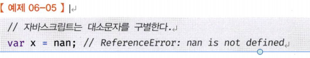

# 06장 데이터 타입

| 구분      | 데이터 타입        | 설명                                                |
| --------- | ------------------ | --------------------------------------------------- |
| 원시 타입 | 숫자number 타입    | 숫자, 정수와 실수 구분 없이 하나의 숫자 타입만 존재 |
|           | 문자열string 타입  | 문자열                                              |
|           | 불리언boolean 타입 | 논리적 참(true)와 거짓(false)                       |
|           | undefined 타입     | var 키워드로 선언된 변수에 암묵적으로 할당되는 값   |
|           | null 타입          | 값이 없다는 것을 의도적으로 명시할 때 사용하는 값   |
|           | 심벌symbol 타입    | ES6에서 추가된 7번째 타입                           |
| 객체 타입 |                    | 객체, 함수, 배열 등                                 |

### 6.1 숫자타입

C나 자바의 경우，정수와 실수를 구분해서 `int`, `long`, `float`, `double` 등과 같은 다양한 숫자 타입을 제공한다. 하지만 자바스크립트는 독특하게 하나의 숫자 타입만 존재한다.
ECMAScript 사양에 따르면 숫자 타입의 값은 배정밀도 64비트 부동소수점 형식을 따른다.

즉, 모든 수를 실수로 처리하며, 정수만 표현하기 위한 데이터 타입integer type이 별도로 존재하지 않는다.

```jsx
// 모두 숫자 타입이다.
var integer = 10; // 정수
var double = 10.12; // 실수
var negative = -20; // 음의 정수
```

```jsx
var binary = 0b01000001; // 2진수
var octal = 0o101; // 8진수
var hex = 0x41; // 16진수

// 표기법만 다를 뿐 모두 같은 값이다.
console.log(binary); // 65
console.log(octal); // 65
console.log(hex); // 65
console.log(binary === octal); // true
console.log(octal === hex); // true
```

정수,실수 , 2진수，8진수 , 16진수 리터럴은 모두 메모리에 배정밀도 64비트 부동소수점 형식의 2진수로 저장 된다.

자바스크립트는 2진수, 8진수 ,16 진수를 표현하기 위한 데이터 타입을 제공하지 않기 때문에 이들값을 참조하면 모두 10 진수로 해석된다.

따라서 자바스크립트에서 진수를 사용하여 값을 표기할때 표기법은 다르지만, 내부적으로는 동일한 실수로 처리되기때문에 값은 같게 나타나도 값자체는 동일하게 처리된다.

```jsx
// 숫자 타입은 모두 실수로 처리된다.
console.log(1 === 1.0); // true
console.log(4 / 2); // 2
console.log(3 / 2); // 1.5
```

```jsx
// 숫자 타입의 세 가지 특별한 값
console.log(10 / 0); // Infinity
console.log(10 / -0); // -Infinity
console.log(1 * "String"); // NaN
```

■ Infinity: 양의 무한대
■ -Infinity：음의 무한대
■ NaN: 산술 연산 불기(not-a-number)

참고



### **6.2 문자열 타입**

문자열 타입string은 텍스트 데이터를 나타내는데 사용한다.

문자열은 0개 이상의 16비트 유니코드 문자(UTF-16)의 집합으로 전 세계 대부분의 문자를 표현할수 있다.

문자열은 작은따옴표( ’ ’ ), 큰따옴표( " " ), 백틱( `  ` )으로 텍스트를 감싼다.

자바스크립트에서는 일반적으로 작은따옴표( ' ' )를 사용한다.

```jsx
// 문자열 타입
var string;
string = "문자열"; // 작은따옴표
string = "문자열"; // 큰따옴표
string = `문자열`; // 백틱 (ES6)

string = '작은따옴표로 감싼 문자열 내의 "큰따옴표"는 문자열로 인식된다.';
string = "큰따옴표로 감싼 문자열 내의 '작은따옴표'는 문자열로 인식된다.";
```

참고

C는 문자열 타입을 제공하지 않고 문자의 배열로 문자열을 표현 자바는 문자열을 객체로 표현 자바스크립트는 문자열은 원시타입이며, 변경 불가능한 값immutable value이다.

//자바스크립트에서는 배열형태의 문자열이 아니기때문에 문자열에 직접적인 접근은 불가능하지만, 다양한 문자열 메서드와 내장 함수를 통해 문자열을 다룰 수 있다. 이러한 함수들을 사용하여 문자열을 조작하고 새로운 값을 할당할 수 있다.

### 6.3 템플릿 리터럴

ES6부터 도입된 새로운 문자 표기법 →템프릿 리터럴template literal

템플릿 리터럴은 멀티라인 문자열multi-line string, 표현식 삽입expression interpolation, 태그드 템플릿tagged template 등 편리한 문자열 처리기능을 제공한다.

백틱( `  ` )을 사용해 표현한다.

```jsx
var template = `Template literal`;
console.log(template); // Template literal
```

**1.멀티라인 문자열**

일반 문자열 내에서는 줄바꿈(개행)이 허용되지 않는다.

하지만 템플릿 리터럴( `  ` )를 사용하면 줄바꿈(개행)이 가능해진다.

<템플릿 리터럴 사용전>

```jsx
var template = '<ul>\n\t<li><a href = "#">Home</a></li>\n</ul>';
console.log(template);
```

일반 문자열 내에서 줄바꿈 등의 공백을 표현하려면 백슬래시( \ )로 시작하는 이스케이프 시퀀스를 사용해야함

<템플릿 리터럴 사용후>

```jsx
var template = `<ul>
	<li><a href = "#">Home</a></li>
</ul>`;
console.log(template);
```

**2.표현식 삽입**

문자열을 연결하려면 + 연산자를 사용해야한다.

템플릿 리터럴에 표현식 삽입을 통해 + 연산자를 사용하지 않고도 간단히 문자열을 연결 할 수 있다.

표현식을 삽입하려면 ${ } 으로 표현식을 감싼다. 이때 표현식의 평가 결과가 문자열이 아니더라도 문자열로 타입이 강제로 변환되어 삽입된다.

```jsx
var first = "Ung-mo";
var last = "Lee";

// ES5: 문자열 연결
console.log("My name is " + first + " " + last + "."); // My name is Ung-mo Lee.

// ES6: 표현식 삽입
console.log(`My name is ${first} ${last}.`); // My name is Ung-mo Lee.

// 템플릿 리터럴 표현식 강제 형 변환
console.log(`1 + 2 = ${1 + 2}`); // 1 + 2 = 3

// 일반 문자열로 작성시 그냥 문자로 출력
console.log("1 + 2 = ${1 + 2}"); // 1 + 2 = ${1 + 2}
```

### 6.4 불리언타입

불리언 타입의 값은 논리적 참, 거짓을 나타내는 true 와 false 뿐이다 .

```jsx
var foo = true;
console.log(foo); // true

foo = false;
console.log(foo); // false
```

### 6.5 undefined 타입

undefined 타입의 값은undefined가 유일하다.

var키워드로 선언한 변수는 암묵적으로undefined로 초기화 된다.

변수를 선언한 이후 아무것도 할당하지 않은 변수를 참조하면 undefined가 반환된다.

```jsx
var foo;
console.log(foo); // undefined
```

undefined는 개발자가 의도적으로 할당하기 위한 값이 아니라 자바스크립트 엔진이 변수를 초기화 할때 사용하는 값이다. 변수를 참조했을때 undefined가 반환된다면 참조한 변수가 선언 이후 값이 할당된 적 없는, 즉 초기화 되지 않은 변수라는 것을 간파할 수 있다.

자바스크립트 엔진이 변수를 초기화하는데 사용하는 undefined를 개발자가 의도적으로 변수에 할당한다면 undefined의 본래취지와 어긋나고 혼란을 줄 수 있으므로 권장하지 않는다.

변수에 값이 없다는 것을 명시하기 위해서는 undefined→null을 할당하자.

//왜 const 와 let은 호이스팅이 발생했을때 참조오류가 뜨나? 예를 들어 let으로 선언한 변수에 선언 이전 블록에서 접근하려고 한다면 변수가 초기화되기 전이므로 에러가 발생합니다. 이러한 동작은 일시적인 사각지대(temporal dead zone)이라고 부르는데, 변수가 선언되었지만 아직 초기화되기전의 영역을 말합니다. 변수가 이영역에 들어가면 초기화 되기 전까지 접근할 수 없습니다.

### 6.6 null 타입

null 타입의 값은 null 유일하다. 자바스크립트는 대소문자를 구별하므로 null 은 Null, NULL등과 다르다.

**변수에 `null`을 할당하면 해당 변수는 어떤 메모리 주소도 가리키지 않는 상태가 된다. 즉, 변수는 더 이상 어떤 객체도 참조하지 않는 상태가 된다.**

```java
var foo = 'Lee';

// 이전에 할당되어 있던 값에 대한 참조를 제거. foo 변수는 더 이상 'Lee'를 참조하지 않는다.
// 유용해 보이지는 않는다. 변수의 스코프를 좁게 만들어 변수 자체를 재빨리 소멸시키는 편이 낫다.
foo = null;
```

### 6.7 심벌 타입

ES6에 새롭게 추가된 7번째 타입으로, 변경 불가능한 원시 타입의 값이다.

심벌 값은 다른 값과 중복되지 않는 유일 무이한 값이다.

그래서 보통 이름이 충돌할 위험이 없는 객체의 유일한 프로퍼티 키를 만들기 위해 사용된다.

심벌 이외의 원시 값은 리터럴을 통해 생성하지만 심벌은 Symbol함수를 호출해 생성한다. 이때 생성된 심벌값은 외부에 노출되지 않으면, 다른값과 절대 중복되지 않는 유일무이한 값이다.

```jsx
// 심벌 값 생성
var key = Symbol("key");
console.log(typeof key); // symbol

// 객체 생성
var obj = {};

// 이름이 충돌할 위험이 없는 유일무이한 값인 심벌을 프로퍼티 키로 사용한다.
obj[key] = "value";
console.log(obj[key]); // value

// 같은 형태로 생성해도 다른 값이다
Symbol("a") === Symbol("a"); // false
```

### 6.8 객체 타입

중요한 것은 자바스크립트는 객체 기반의 언어이며, 자바스크립트를 이루고 있는 거의 모든 것이 객체라는 것이다. 지금까지 살펴본 6가지 데이터 타입 이외의 값은 모두 객체 타입이다.

### 6.9 데이터 타입의 필요성

■ 메모리에 값을 저장하려면, 값이 차지하는 메모리 공간의 크기를 고려하여 충분한 메모리를 확보해야 합니다. 이를 통해 값의 저장에 있어서 낭비와 손실 없이 효율적으로 처리할 수 있습니다.

■ 값을 참조할 때 한 번에 읽어 들여야 할 메모리 공간의 크기를 결정하기 위해

■ 메모리에서 읽어 들인 2진수를 어떻게 해석할지 결정하기 위해. //메모리에 2진수, 즉 비트의 나열로 저장되는데 메모리에 저장된 값은 타입에 따라 다르게 해석될수 있다.예를 들면 0100 0001은 숫자로 65, 문자열로 ‘A’다.

### 6.10 동적 타이핑

<**정적타입언어**>

정적타입(static) 언어로 C, C++, 자바, 코틀린, 고어, 하스켈, 러스트, 스칼라 등이 있다.

정적타입 언어는 변수의 타입을 변경할 수 없으며, 변수에 선언한 타입에 맞는 값만 할당할 수 있다.

따라서 변수를 선언할 때 어떤 타입인지 사전에 지정해 줘야 한다. 이를 명시적 타입 선언(explicit type declaration)이라 한다.

```java
// c 변수에는 1바이트 정수 타입의 값(-128 ~ 127)만을 할당할 수 있다.
char c;

// num 변수에는 4바이트 정수 타입의 값(-2,124,483,648 ~ 2,124,483,647)만을 할당할 수 있다.
int num;
```

정적 타입 언어는 컴파일 시점에 **타입체크**를 수행한다. 만약 타입체크를 통과하지 못하면 에러를 발생시키고 컴파일이 안된다.

이를 통해 타입의 일관성을 강제함으로써 더욱 안정적인 코드의 구현을 통해 런타임에 발생하는 에러를 줄인다.

<동적**타입언어**>

동적 타입 언어는 변수에 어떤 데이터 타입의 값이라도 자유롭게 할당 가능하다.

다만 `var`, `let`, `const` 키워드를 사용해서 변수를 선언할 뿐이다.

```jsx
var foo;
console.log(typeof foo); // undefined

foo = 3;
console.log(typeof foo); // number

foo = "Hello";
console.log(typeof foo); // string

foo = true;
console.log(typeof foo); // boolean

foo = null;
console.log(typeof foo); // object

foo = Symbol(); // 심벌
console.log(typeof foo); // symbol

foo = {}; // 객체
console.log(typeof foo); // object

foo = []; // 배열
console.log(typeof foo); // object

foo = function () {}; // 함수
console.log(typeof foo); // function
```

동적 타입 언어는 어떤 데이터라도 자유롭게 할당할 수 있고 편리하다는 장점이있다.

하지만 변수의 값은 언제든지 변경될 수 있기 때문에 복잡한 프로그램에서는 변화하는 변수 값을 추적하기 어려울수 있다. 또한 변수는 값의 변경에 의해 언제든지 타입도 변할 수 있기 때문에 변수의 값을 확인하기전에는 타입을 확신 할 수 없다.

게다가 자바스크립트 엔진에 의해 암묵적으로 타입이 자동 변환되는 `암묵적 타입 변환`이 있어 개발자의 의도와 상관없이 타입이 바뀌어 프로그램이 오류를 뿜어 낼 수 도 있다.

**ex)**

```jsx
var number = 10;
var string = "5";

var result = number + string;

console.log(result);// "105" (문자열로 변환되어 연결됨)
-------------------------------------------------------------------
let number = 10;
let string = "5";

console.log(number > string); // true (문자열을 숫자로 변환하여 비교)
-------------------------------------------------------------------
console.log(1 == "1"); // true (암묵적 타입 변환으로 인해 true 반환)
console.log(0 == false); // true (암묵적 타입 변환으로 인해 true 반환)
```

<_동적 타입 언어 사용시 주의사항>_

> _변수는 꼭 필요한 경우에 한해 제한적으로 사용한다._

> _변수의 유효 범위는 최대한 좁게 만들어 변수의 부작용을 억제해야 한다._

> _전역 변수는 최대한 사용하지 않도록 한다._

> _변수보다는 상수를 사용해 값의 변경을 억제한다._

> _변수 이름은 변수의 목적이나 의미를 파악할 수 있도록 네이밍한다._
